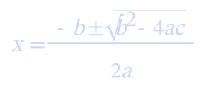
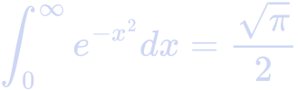
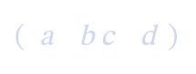

# termtex

`termtex` is a lightweight, pure Go CLI tool that renders LaTeX math expressions and mixed Markdown documents directly into the terminal window using vector SVG typesetting and the **Kitty Graphics Protocol**.

It supports both **inline math** (`$ ... $` or `\( ... \)`) and **block math** (`$$ ... $$` or `\[ ... \]`) interspersed with plain text, without requiring MathJax or heavy LaTeX installations.



---

## ✨ Features

- **Mixed Document Rendering**: Interleave plain text, inline equations (`$V(S_t)$`), and centered block equations (`$$\sum_{i=1}^n x_i$$`).
- **Pure Go Parser & Typesetter**: Built-in recursive-descent TeX parser and box layout engine.
- **Kitty Graphics Protocol**: Crisp, pixel-perfect inline and block math images rendered directly in Kitty, Ghostty, WezTerm, and compatible terminals.
- **Vector SVG & PNG Export**: Output cleanly to `.svg` or `.png` files.
- **Unicode Terminal Fallback**: Terminal text fallback mode (`-f text`) for standard environments.
- **Standard Math Subset**:
  - Fractions: `\frac{a}{b}`
  - Square & N-th Roots: `\sqrt{x}`, `\sqrt[n]{x}`
  - Subscripts & Superscripts: `x_i`, `e^{-x^2}`, `\sum_{i=1}^n`
  - Big Operators: `\sum`, `\prod`, `\int`, `\iint`, `\iiint`, `\oint`, `\lim`, `\max`, `\min`
  - Delimiters & Braces: `\left( ... \right)`, `\left[ ... \right]`, `\left\{ ... \right\}`, `\left\langle ... \right\rangle`
  - Environments: `\begin{pmatrix}`, `\begin{bmatrix}`, `\begin{cases}`
  - Greek Letters & Accents: `\alpha`, `\beta`, `\Delta`, `\hat{x}`, `\vec{v}`, `\bar{z}`

---

## 📸 Output Examples

### Definite Integral & Square Root
`\int_0^\infty e^{-x^2} dx = \frac{\sqrt{\pi}}{2}`



### Piecewise Functions
`\begin{cases} x & \text{if } x > 0 \\ -x & \text{otherwise} \end{cases}`


### Matrix Layout
`\begin{pmatrix} a & b \\ c & d \end{pmatrix}`



---

## 🚀 Installation

### Prerequisites
- **Go 1.20+**
- **`rsvg-convert`** (for SVG-to-PNG terminal rasterization):
  - macOS: `brew install librsvg`
  - Linux (Ubuntu/Debian): `sudo apt install librsvg2-bin`

### Install via `go install`
```bash
go install github.com/junosuarez/termtex@latest
```

### Build from Source
```bash
git clone https://github.com/junosuarez/termtex.git
cd termtex
go build -o termtex main.go
```

---

## 🛠️ Usage

```bash
# Render a Markdown file containing inline & block math
termtex document.md

# Render mixed text with inline math
termtex "Where \$V(S_t)\$ is the value of state \$S_t\$."

# Render a single TeX expression
termtex "\frac{1}{x^2+1}"

# Pipe Markdown from STDIN
echo "Formula: \$\$ \int_0^1 x dx \$\$" | termtex

# Save SVG or PNG output to file
termtex -o formula.svg "\frac{a}{b}"
termtex -o formula.png "\sqrt[3]{x^2+y^2}"
```

---

## 📄 License

This project is dedicated to the public domain under the [CC0 1.0 Universal Public Domain Dedication](LICENSE).
